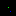
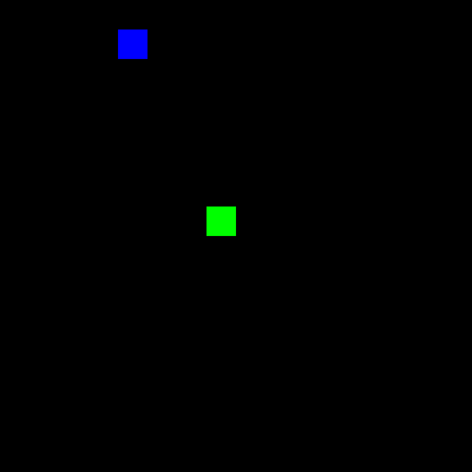

# snake-rl

A Snake custom [gymnasium](https://gymnasium.farama.org/) environment, and a framework to train Deep Q Learning agents to play it using PyTorch.

<table>
<caption>A convolutional neural network based DQN agent ravaging them fruits</caption>
<tr>
<td>
<figure class="left">

<figcaption>2366 episodes</figcaption>
</figure>
</td>
<td>
<figure class="right">

<figcaption>54798 episodes</figcaption>
</figure>
</td>
</tr>
</table>

## Usage

Define your `DQN` network class as a PyTorch `nn.Module` subclass in the `src/model.py` module, customize your training and environment configurations in `config.json`, and run

```shell
python train.py
```

The script will run the agent for the predefined number of episodes, and at each step perform an update of the Q network via stochastic gradient descent, as prescribed in the glorious [Atari paper](https://doi.org/10.48550/arXiv.1312.5602) where this algorithm was first introduced.

At each episode, the script will report some useful metrics, along with a full replay of the episode, in the `runs/{run_name}` folder, using PyTorch's TensorBoard support, and at the end of the training also save a copy of the trained model in the same folder.

## The environment

This is simply an implementation of the standard logic of the classic videogame of [Snake](https://en.wikipedia.org/wiki/Snake_(video_game_genre)) as a `gymnasium` environment. It provides all the expected methods and attributes of the environment class, such as resetting the environment, performing actions and returning observations.

### Observation space

The environment returns the last $k$ frames of the game as observations, and each frame is a 2D $width \times height$ matrix filled with $0$ in empty cells, $-1$ in the cell where the food is, and can be configured to either represent with $1$ every cell occupied by the snake, or provide the additional information about the snake's head and body by filling these cells with growing integers where $1$ is the head.

When calling the `.reset()` method on the environment, a new episode is started, and based on the number of frames required by the observation, the first $k$ actions are chosen at random. If this results in a failure, the RNG is reseeded and a new episode is started. 

Additional informations about the episode and the state are provided in the `info` dictionary that is returned every step.

### Action space

The action space can be configured to be either:

1. `absolute`: each action corresponds to a direction (much like a D-pad on videogames controllers), so there are 4 possible actions. Based on the current direction of the snake, pressing the action corresponding to the inverse of the direction will result in the snake ignoring the command and continuing along the previous direction.

2. `relative`: each action corresponds to a direction relative to the snake's current direction; in this case only 3 actions are possible: keep going forward, or turn either right or left.

#### Failure

The episode ends whenever the chosen action would:

1. place the head in a cell already occupied by the snake
2. place the head outside the "screen" (if `periodic` argument is set to `False`; otherwise a PBC mechanism would place the head at the opposite side)
3. place the head in an empty cell, but the number of steps performed without eating any food exceeds a predefined number. This acts as a stopping threshold whenever the agent gets stuck in a loop.


### Additional configurations

If render argument is set to `human`, at each step a `PyGame` window is updated to show the current state of the game. 

At each step, the environment returns a reward, based on one of three possible outcomes of the step:

1. *Empty step*: by default, this is $0$, but can be set to negative or positive values to explore the effect on the policy convergence
2. *Eat food*: this is the reward that the agent obtains whenever a step results in successfully eating a fruit
3. *Failing*: whenever a step results in the episode ending for any of the reasons listed above


